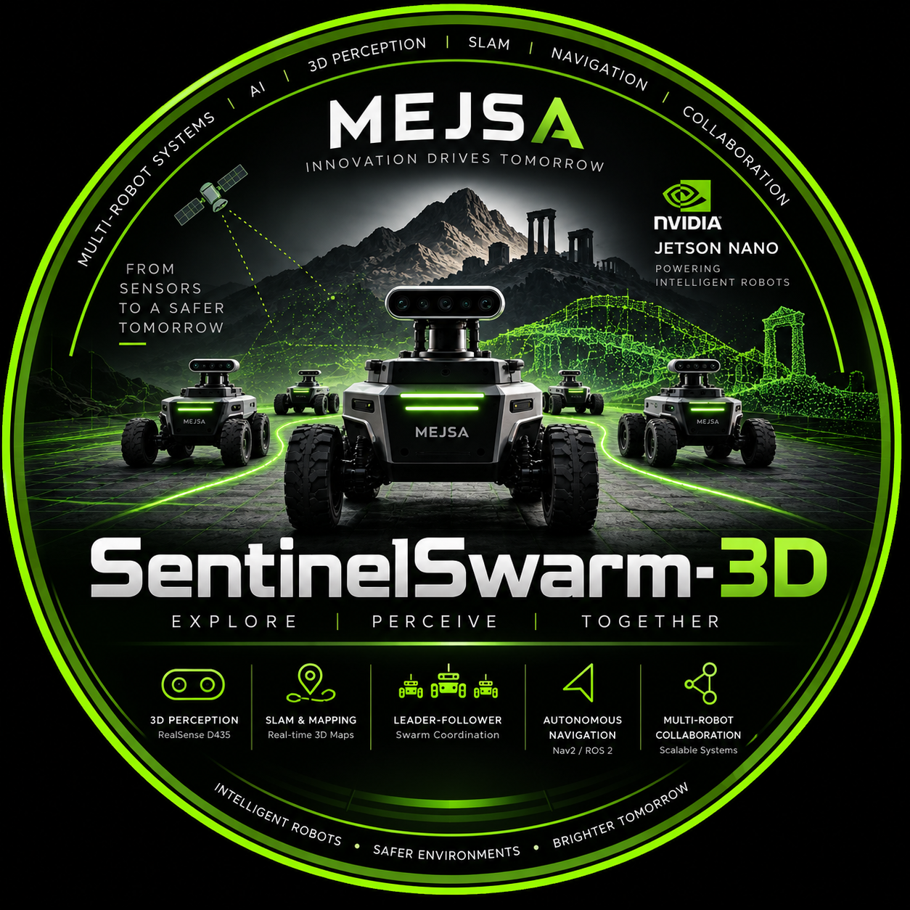
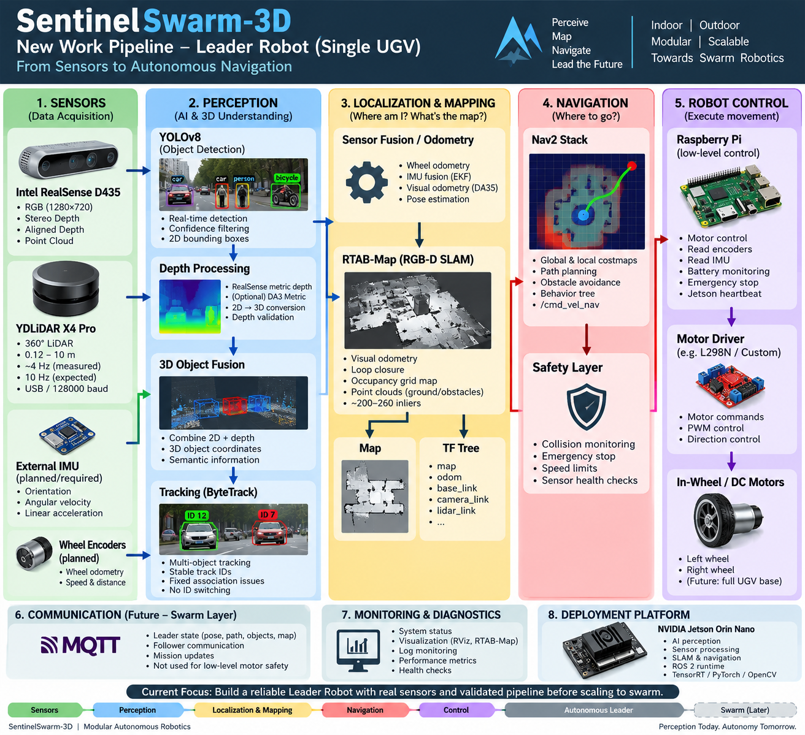

<div align="center">



# SentinelSwarm-3D

### MEJSA — Intelligent Swarm Robotics

An intelligent multi-robot swarm robotics platform integrating 3D perception, sensor fusion, SLAM, autonomous navigation, and Leader–Follower coordination.

</div>

---
# SentinelSwarm-3D

A modular, production-oriented research prototype for a multi-robot
Leader-Follower swarm: semantic 3D perception (YOLO + Depth Anything 3),
metric object localization, D* Lite / DWA navigation, MQTT swarm
communication, formation control, and an optional asynchronous ShapeR
reconstruction service.

This repository is being built **phase by phase** (see "Roadmap" below).
**Phase 1 is implemented and runnable today.** Everything past Phase 1 is
present only as typed interfaces/stubs so later phases plug in without
reshaping what already works.

## Architecture at a glance
<div align="center">



</div>

```
RGB Camera Frame
      |
      +-------------------+
      |                   |
      v                   v
YOLO Object Detection   Depth Anything 3 (async, own thread)
      |                   |
      v                   v
Bounding Boxes          Depth Map
      |                   |
      +---------+---------+
                |
                v
        3D Object Fusion   (median depth in bbox + pinhole back-projection)
                |
                v
         Object Tracking    (ByteTrack, persistent IDs)
                |
                v
      Visualization Dashboard
```

Layers are independent packages under this repo root (`perception/`,
`geometry/`, `localization/`, `mapping/`, `navigation/`, `swarm/`,
`shaper/`, `hardware/`, `visualization/`), each configured from YAML
(`config/*.yaml`) and behind an abstract interface (`base_*.py`) so any
concrete implementation — which YOLO checkpoint, which depth model, which
tracker, which planner — can be swapped without touching callers.

The real-time navigation/perception path never depends on ShapeR
(`shaper/`): that package's client is fire-and-forget and background-only
by construction (see `shaper/base_shaper_client.py`).

## Project structure

```
sentinel-swarm/
├── main.py                    # Phase 1 entry point (camera/YOLO/DA3 pipeline, single process)
├── run_leader.py               # Leader-only runtime entry point (Phase 1A/1B, process supervisor)
├── requirements.txt
├── pytest.ini
├── config/
│   ├── system.yaml             # top-level: mode, active layers, watchdog
│   ├── camera.yaml              # source + intrinsics + extrinsics
│   ├── perception.yaml          # detector/depth/fusion/tracker/viz params
│   ├── navigation.yaml          # planners, safety, formation (Phase 4+)
│   ├── mqtt.yaml                 # broker + topics (Phase 5+)
│   ├── robots.yaml               # fleet definition (leader/follower_01/02)
│   ├── leader.yaml                # leader-only mode flags (Phase 1A)
│   ├── lidar.yaml                  # XPLIDAR driver + obstacle sectors (Phase 1B)
│   └── safety.yaml                  # safety envelope contract (enforced starting Phase 1G)
├── common/
│   ├── types.py                  # BBox, Detection2D, DetectedObject3D, Pose3D, LidarScan, ...
│   ├── config_loader.py          # YAML loading + merging
│   └── logging_utils.py          # structured logging, robot_id-tagged
├── hardware/
│   ├── base.py                   # BaseSensor interface
│   ├── camera.py                  # DeviceCamera / VideoFileCamera / SyntheticCamera
│   └── lidar/
│       ├── __init__.py              # build_lidar_from_config() factory (mock vs real)
│       ├── base_lidar.py             # BaseLidar interface
│       ├── ydlidar_x4_pro_driver.py   # YDLidarX4ProDriver (official YDLiDAR SDK)
│       ├── mock_lidar.py               # MockLidar (explicit simulation only)
│       ├── scan_processor.py            # filtering / angle normalization / noise rejection
│       └── obstacle_sectors.py           # per-sector clearance + safety banding
├── geometry/
│   └── transforms.py              # pixel->camera->world, RPY rotations
├── perception/
│   ├── detector/                  # BaseObjectDetector, YOLODetector
│   ├── depth/                     # BaseDepthEstimator, DA3DepthEstimator (async)
│   ├── tracking/                  # BaseTracker, ByteTrack + IOU fallback
│   └── fusion.py                   # 3D Object Fusion
├── localization/                  # PoseEstimator interface (Phase 3+)
├── mapping/                        # SemanticMap (usable now; occupancy = Phase 4)
├── navigation/                      # GlobalPlanner/LocalPlanner interfaces (Phase 4+); safety_controller = Phase 1G
├── swarm/                           # CommunicationClient + MQTT impl (Phase 5+; disabled by config/leader.yaml today)
├── shaper/                          # BaseShaperClient (Phase 8, optional; disabled by config/leader.yaml today)
├── runtime/
│   ├── process_manager.py           # generic multiprocessing supervisor (Phase 1A)
│   ├── shared_state.py               # cross-process "latest value" IPC primitive
│   └── lidar_process.py               # lidar_scan_thread + scan_processing_thread (Phase 1B)
├── visualization/
│   ├── dashboard.py                 # Phase 1 monitoring dashboard (camera/YOLO/depth)
│   └── lidar_view.py                  # Phase 1B: live LiDAR scan + sector clearances
└── tests/
    ├── test_fusion.py
    ├── test_depth_interface.py
    ├── test_semantic_map.py
    ├── test_lidar.py
    ├── test_ydlidar_x4_pro.py
    ├── test_lidar_process.py
    └── test_process_manager.py
```

## Requirements

* Python 3.10+
* See `requirements.txt`. Notably: `opencv-python`, `torch`/`torchvision`,
  `ultralytics` (YOLO), `supervision` (ByteTrack), `paho-mqtt` (Phase 5+),
  `pyserial` (optional, real LiDAR hardware only — see Phase 1B below).

None of these are hard-required to *run* Phase 1: every model-backed
component (YOLO, DA3, ByteTrack) detects a missing dependency or failed
model load and degrades gracefully — logging a warning once and continuing
in a no-op/mock mode — rather than crashing. This means you can clone this
repo on a machine with no GPU, no internet access, and no camera, and still
see the full pipeline run end-to-end using `SyntheticCamera` and DA3's mock
depth backend.

## Running Phase 1

### 1. Install dependencies

```bash
cd sentinel-swarm
python3 -m venv .venv && source .venv/bin/activate
pip install -r requirements.txt
```

(You can skip this and run with zero dependencies installed — you'll get
the synthetic camera + mock YOLO/depth path, which is enough to validate
the pipeline's control flow and unit tests.)

### 2. Zero-hardware smoke test (synthetic camera, no GUI)

```bash
python main.py --headless --max-frames 100
```

This exercises the full Camera → YOLO → DA3 → Fusion → Tracker loop against
`SyntheticCamera`'s procedurally generated frames and exits after 100
frames — useful in CI or a container with no display and no webcam.

### 3. With a real webcam and a display

Edit `config/camera.yaml`:

```yaml
camera:
  source_type: "device"
  device_index: 0
```

Then:

```bash
python main.py
```

A window titled "SentinelSwarm-3D | Phase 1" opens showing the live feed
with YOLO boxes + track IDs on the left and the colorized depth map on the
right, with an FPS/object-count HUD. Press Ctrl+C to stop.

### 4. Calibrate your camera (before trusting metric output)

`config/camera.yaml`'s `intrinsics` block ships with a rough 720p-webcam
guess. Run an OpenCV checkerboard calibration and replace `fx/fy/cx/cy`
(and `distortion`) before relying on `camera_coords`/`world_coords` for
anything beyond qualitative testing.

### 5. Run the unit tests

```bash
pytest
```

Tests cover the pinhole back-projection math, the fusion module's median-
depth extraction and depth-range gating, the DA3 estimator's async
interface contract (using its mock backend), and the semantic map's
confidence-weighted fusion. All run without a GPU or model weights.

## Configuration model

`config/system.yaml` is the entry point; it lists every other config file
under `config_files` and `common.config_loader.load_system_config()` merges
them into one dict passed everywhere (`build_camera_from_config(cfg)`,
`build_detector_from_config(cfg)`, etc.). The `system.layers` block is the
single source of truth for which layers are active — Phase 1 ships with
only `perception` and `visualization` set to `true`; flip the rest on as
later phases land, without changing any Python.

## Leader-only runtime (Phase 1A / 1B)

Alongside main.py's single-process Phase 1 pipeline, the repo now also has
a **leader-only** runtime for the current development stage: exactly one
autonomous Leader UGV, with every swarm/multi-robot capability
(`swarm/`, `shaper/`, MQTT, formation control) present in the codebase but
never started. Nothing about main.py or the Phase 1 perception pipeline
changed — this is a second, independent entry point.

```
python run_leader.py                      # real YDLiDAR X4 Pro (per config/lidar.yaml)
python run_leader.py --simulation          # MockLidar, no hardware touched
python run_leader.py --headless             # no LiDAR view window
python run_leader.py --max-seconds 20        # run for N seconds then exit (CI/demo)
python -m runtime.lidar_process --seconds 10  # LiDAR-only diagnostic
```

`config/leader.yaml` is the single source of truth for what's active:

```yaml
leader:
  robot_role: "leader"
  robot_mode: "leader_only"
  swarm_enabled: false
  followers_enabled: false
  formation_enabled: false
  global_multi_robot_map_enabled: false
  shaper_enabled: false
  motors_enabled: false
```

`runtime/process_manager.py` is a generic multiprocessing supervisor
(register/start_all/stop_all, with bounded crash-restart) that
`run_leader.py` uses to launch whatever is both implemented and enabled.
Today that's exactly one process: `lidar_process` (`runtime/lidar_process.py`),
which wraps the new `hardware/lidar/` stack —

* `hardware/lidar/base_lidar.py` — `BaseLidar` interface
  (`initialize/start/stop/get_scan/get_latest_scan/is_healthy/get_status/
  shutdown`), not tied to any specific LiDAR model.
* `hardware/lidar/ydlidar_x4_pro_driver.py` — `YDLidarX4ProDriver`, the
  real hardware driver, built on the official YDLiDAR SDK. Every
  `ydlidar.*` call in the project lives in this one file.
* `hardware/lidar/mock_lidar.py` — `MockLidar`, synthetic scans for
  simulation. Selected **only** by `simulation_mode: true`; never
  substituted automatically for a failed real device.
* `hardware/lidar/scan_processor.py` — invalid/range filtering (the X4
  Pro's 0.12–10.0 m window), angle normalization, conservative
  isolated-spike rejection, valid/invalid point accounting.
* `hardware/lidar/obstacle_sectors.py` — `ObstacleSectorAnalyzer`: reduces
  a scan to per-sector (FRONT/FRONT_LEFT/FRONT_RIGHT/LEFT/RIGHT/REAR)
  min/median distance + `obstacle_detected`, with
  `get_front/left/right/rear_clearance()` helpers and the
  NORMAL/CAUTION/STOP/EMERGENCY banding for the safety layer that arrives
  in Phase 1G/1H.

`visualization/lidar_view.py` is a separate panel (`dashboard.py` is
untouched) that draws a top-down polar plot of the live scan plus sector
clearances, device status (port/baud/scan rate) and the front safety level
when `run_leader.py` isn't run with `--headless`.

### YDLiDAR X4 Pro configuration

`config/lidar.yaml` carries the device profile. The hardware-fact fields
are validated at construction against the driver's built-in `X4ProProfile`
and a mismatch raises `LidarConfigurationError` at startup rather than
producing silence or garbage at runtime:

| Field | Value | Enforced |
|---|---|---|
| `driver` / `model` | `ydlidar_x4_pro` / `X4_PRO` | factory selection |
| `baudrate` | `128000` | exact match required |
| `sample_rate` | `5` (kHz) | exact match required |
| `min_distance` / `max_distance` | `0.12` / `10.0` m | must sit inside hardware limits |
| `expected_scan_frequency_hz` | `10.0` | must be within the 6–12 Hz band |
| `lidar_type` | `triangle` (TYPE_TRIANGLE) | must not be ToF |
| `single_channel` | `true` | must be true |
| `is_tof` | `false` | must be false |
| `reversion` / `inverted` | `true` / `false` | passed to the SDK |
| `angle_offset` | `0.0` | extra mounting calibration, applied by this project |
| `auto_reconnect`, `scan_timeout`, `health_check_interval` | `true`, `2.0`, `1.0` | failure/recovery policy |

**`expected_scan_frequency_hz` is an expectation, not a command.** The X4
Pro's rotation rate is governed by its motor, and this project does not
assume the SDK can change it. The value is used for configuration
plausibility checks, health monitoring, and diagnostics only. The option is
still passed to the SDK's `LidarPropScanFrequency` (that being the
documented way to express a desired rate) but it is treated as a hint —
`LidarStatus` reports the **measured** `scan_rate_hz` alongside the
configured `expected_scan_rate_hz` so a discrepancy is visible rather than
assumed away. The diagnostic prints them together as
`rate=9.8Hz (expected 10.0Hz)`.

**Angles and units:** distances are always meters; the stored angle is
always signed degrees in `[-180, 180)` with 0 = forward and positive =
counter-clockwise (left). The SDK reports radians, and the driver converts
on the way in; `LidarPoint.angle_rad` gives the radian view for navigation
math. `reversion`/`inverted` are applied by the SDK, `angle_offset` by this
project — so they are never double-counted.

### Automatic serial port detection

With `port: "auto"` the driver builds a candidate list, most reliable
first, and **verifies each one with the SDK before accepting it**:

1. `ydlidar.lidarPortList()` — the SDK's own enumeration, which recognizes
   the adapter rather than guessing from a path.
2. `/dev/ydlidar` (the udev symlink YDLIDAR's rules install), then
   `/dev/ttyUSB0`, `/dev/ttyUSB1`, `/dev/ttyACM0`, `/dev/ttyACM1` — but
   only those that actually exist on the machine.

Each candidate is probed with a throwaway `CYdLidar` handle configured for
the X4 Pro; only a successful SDK `initialize()` (which talks to the device
and reads its info/health) qualifies, and the probe handle is released
before the real one opens. A USB-serial adapter for something else sitting
on `/dev/ttyUSB0` is therefore rejected rather than driven as if it were a
LiDAR. Setting `port: "/dev/ttyUSB0"` explicitly skips the search, but the
device is still verified — so a stale path fails loudly instead of going
quiet.

### Failure behavior (important)

If the SDK is missing, no device is found, initialization fails, or scans
stop arriving, the LiDAR is reported **unhealthy with a specific error
message and publishes no scans**. It is never silently replaced by
`MockLidar`. A robot acting on invented obstacle readings it believes are
real is far more dangerous than one that knows its LiDAR is down, so
simulation is always an explicit choice (`--simulation` or
`simulation_mode: true`). `lidar_process` also clears its published
obstacle data once it goes past `scan_timeout`, so stale scans can't be
mistaken for current ones, and with `auto_reconnect: true` a USB
disconnect is recovered without restarting the process.

**No motor-control code exists anywhere in the repository yet** — that's
Phase 1E/1F. `config/leader.yaml`'s `motors_enabled: false` and
`config/safety.yaml` (heartbeat timeout, caution/stop/emergency distances,
velocity limits) are the config *contract* those phases will enforce
against; the enforcing code (`navigation/safety_controller.py`, the
Raspberry Pi `safety_process`) is not implemented yet.

### Bringing up the real YDLiDAR X4 Pro

1. **Install the SDK** (not a PyPI package):
   ```bash
   git clone https://github.com/YDLIDAR/YDLidar-SDK
   cd YDLidar-SDK && mkdir build && cd build
   cmake .. && make && sudo make install
   cd ../ && pip install .
   ```
2. **Install the udev rule** so the device appears as `/dev/ydlidar` and is
   readable without root:
   ```bash
   cd YDLidar-SDK/startup && sudo sh initenv.sh
   ```
   Otherwise add your user to the `dialout` group and re-login.
3. **Connect the X4 Pro** to the Jetson's USB port (via its USB adapter
   board), confirm the device node appears:
   ```bash
   ls -l /dev/ydlidar /dev/ttyUSB*
   ```
4. **Run the LiDAR-only diagnostic first** — before the full runtime:
   ```bash
   python -m runtime.lidar_process --seconds 10
   ```
   Confirm `connected=True scanning=True healthy=True`, a few hundred valid
   points per scan, and sector clearances that change sensibly when you put
   an object in front of the sensor.
5. **Then run the Leader runtime:** `python run_leader.py`.

#### What must be confirmed against the physical unit

Two profile values cannot be settled from documentation and should be
checked on the bench during step 4:

* **`single_channel`** (currently `true`). This selects whether the SDK
  expects the device-info/health handshake on connect. If it is wrong, the
  usual symptom is `initialize()` failing, or a device that connects but
  streams no points — *not* a subtly wrong measurement. If bench testing
  contradicts it, change `X4ProProfile.single_channel` in
  `hardware/lidar/ydlidar_x4_pro_driver.py` (one line); validation, the SDK
  option, and the config check all derive from it.
* **Actual rotation rate.** Compare the diagnostic's measured
  `rate=` against the configured `expected` value. If they disagree
  consistently, set `expected_scan_frequency_hz` to what the hardware
  really does rather than assuming the SDK will move it.

`config/lidar.yaml` already ships with `simulation_mode: false`, so no
config change is needed for real hardware; use `--simulation` when you want
the mock instead.

## Perception pipeline (Phase 2)

```
USB RGB camera -> camera_process -> FramePacket (newest only)
                                         |
                                   +-----+-----+
                                   |           |
                                 YOLO         DA3        <- both on the SAME frame
                                   |           |
                                   +-----+-----+
                                         |
                                 perception_process
                                         |
                                  PerceptionResult -> visualization / diagnostics
```

Two processes, registered with the same `ProcessManager` as `lidar_process`:

* `runtime/camera_process.py` — opens the configured USB camera, captures on
  one internal thread (OpenCV's `read()` blocks, so it stays off the
  publishing loop), and publishes **only the newest frame**. Paces itself to
  the configured FPS so a non-blocking source (synthetic frames, a video
  file) can't spin a core. Reconnects with exponential backoff and reports
  `CameraStatus` (device, resolution, measured FPS, sequence, drops, errors).
* `runtime/perception_process.py` — runs YOLO and depth on the same frame and
  publishes one `PerceptionResult` with per-stage timing. Frames older than
  `perception.process.stale_frame_max_age_s` are discarded rather than
  processed late.

**The perception pipeline does not depend on the LiDAR.** Camera and
perception publish on their own queues; a degraded LiDAR cannot stop or
distort them. LiDAR fusion is a later phase.

### Depth units — important

`DA3` here is **monocular** depth. Its output is `DepthKind.RELATIVE`:
internally consistent within a frame, but **unitless and up to an unknown
scale**. It is not meters, and nothing in the pipeline converts it to
meters or labels it as distance — `DepthFrame.kind` travels with every
depth map, the visualization prints `RELATIVE (not meters)`, and
`DepthKind.UNKNOWN` is the default for any estimator that hasn't declared
its units. Metric 3D localization needs either a metric source (stereo,
RGB-D, a metric-finetuned model) or a scale solved against a known
reference first.

By default `perception.depth.model_path` is empty, which runs the **mock**
generator — synthetic values that carry no information about the real
scene. It is logged as a warning at startup and flagged `[SIMULATED]` in
diagnostics. To run a real model on the Jetson:

```yaml
perception:
  depth:
    backend: "transformers"
    model_path: "depth-anything/Depth-Anything-V2-Small-hf"   # or a local dir
    device: "cuda:0"
    precision: "fp16"
```
(`pip install transformers`. The model is loaded once at process start, and
inference runs under `torch.inference_mode()`.) The fastest Jetson path is a
prebuilt TensorRT engine; that belongs behind the same `BaseDepthEstimator`
interface as a sibling backend and is not implemented here because it can't
be built or verified without the device.

### Phase 2 commands

```
python -m runtime.camera_process --seconds 10        # camera only
python -m runtime.perception_process --seconds 10     # camera + YOLO + DA3
python run_leader.py                                   # full leader runtime
python run_leader.py --headless --max-seconds 20        # no windows
```
Both diagnostics exit 1 when unhealthy, so they can gate a bring-up script.
Neither produces any motion command — there is still no motor-control code
anywhere in the repository.

## Jetson Orin Nano bring-up

Start here, and check after every step rather than at the end:

```bash
python tools/jetson_preflight.py
```

It reports PASS/WARN/FAIL with a specific next action for each check
(platform, power mode, PyTorch CUDA, ultralytics, transformers, OpenCV,
`/dev/video*` and their pixel formats, real camera FPS, YOLO and depth load
+ timing, LiDAR port) and exits non-zero if anything is blocking.
`--skip-models` makes it fast; `--json` makes it machine-readable.

### The two installs that go wrong

**1. PyTorch — do NOT `pip install torch`.** PyPI has no CUDA-enabled
aarch64 build, so you get a CPU-only or wrong-arch wheel. Everything then
"works" while running several times slower on the CPU, which is a
frustrating thing to debug after the fact. Check your JetPack version:

```bash
cat /etc/nv_tegra_release
```

and install the matching PyTorch wheel from NVIDIA's Jetson distribution
(their "PyTorch for Jetson" resources, or a `jetson-containers` image,
which is the lowest-friction route). Verify before going further:

```bash
python -c "import torch; print(torch.__version__, torch.cuda.is_available())"
```

`cuda.is_available()` must print `True`. The preflight fails loudly if not.

**2. Ultralytics will clobber that wheel.** A plain `pip install
ultralytics` pulls its own `torch`/`torchvision` from PyPI and overwrites
the Jetson build you just installed — silently undoing step 1. Install it
without dependencies and add the rest by hand:

```bash
pip install ultralytics --no-deps
pip install pyyaml pillow requests scipy matplotlib pandas tqdm psutil py-cpuinfo
python -c "import torch; print(torch.cuda.is_available())"   # confirm still True
```

### Performance mode

```bash
sudo nvpmodel -m 0      # max performance
sudo jetson_clocks      # pin clocks
```

A low-power mode roughly halves inference throughput. The preflight warns
if you're not in a performance mode.

### Camera

The pixel format matters more than anything else here. A USB webcam
defaults to uncompressed **YUYV**, whose bandwidth caps 1280x720 at roughly
5–10 FPS over USB 2.0; **MJPG** is compressed and reaches the full 30 FPS
at the same resolution. Check what your camera actually offers:

```bash
sudo apt install v4l-utils
v4l2-ctl --list-devices
v4l2-ctl --list-formats-ext -d /dev/video0
```

`config/camera.yaml`'s `hardware` block already requests MJPG, the V4L2
backend, and a capture buffer depth of 1 — the last one matters because
V4L2 queues frames and `read()` returns the *oldest*, so the default depth
of ~4 hands the pipeline frames that are already ~130 ms stale and quietly
defeats the latest-frame-only design. The camera logs what it actually
negotiated and warns when the request wasn't honored.

Point the config at your device and require it (no synthetic fallback):

```yaml
camera:
  source_type: "device"
  device_path: "/dev/video0"     # preferred over device_index
  width: 1280
  height: 720
  fps: 30
```

If your user can't read the device: `sudo usermod -aG video $USER`, then
log out and back in. Then:

```bash
python -m runtime.camera_process --seconds 10
```

### Depth model

```bash
pip install transformers
```

```yaml
perception:
  depth:
    backend: "transformers"
    model_path: "depth-anything/Depth-Anything-V2-Small-hf"
    device: "cuda:0"
    precision: "fp16"
    inference_resolution: [504, 280]
```

Small is the right size for an 8 GB Orin Nano alongside YOLO; Base/Large
will fit poorly next to everything else. Remember the output is **relative,
not metric** (see the depth section above).

### Expected performance, and the throughput trap

On an Orin Nano, YOLOv8n at `imgsz: 640` lands around 20–40 ms/frame with
CUDA. Depth Anything V2 Small through **PyTorch** is much slower — expect a
few hundred ms. Because detection and depth run on the same frame (that is
what makes their pairing trustworthy), naive settings give you:

```
perception FPS = 1 / (yolo + depth)  ->  roughly 3-5 FPS
```

which drags your *detections* down to depth's rate. Three ways out, in
increasing order of effort:

1. **Decouple the rates.** `perception.process.depth_every_n_frames: 5`
   runs detection on every frame and depth on every 5th. This does not
   weaken synchronization — a result either carries depth from that same
   frame, or carries none at all.
2. **Shrink the work.** Lower `inference_resolution`, or `imgsz: 416`.
3. **TensorRT.** Your earlier measurement of ~109 ms at 504x280 was a
   TensorRT engine, and that remains the right answer for sustained
   throughput. It belongs behind the existing `BaseDepthEstimator`
   interface as a sibling backend class — the seam is already there; it
   isn't implemented because it can't be built or verified without the
   device.

### Memory

The Orin Nano's 8 GB is shared between CPU and GPU. YOLOv8n + Depth
Anything V2 Small + the LiDAR and camera processes fit, but there isn't
much headroom. Watch it with `tegrastats` while running, and if you hit
pressure, drop `publish_frame`/`publish_depth` in
`perception.process` (visualization copies) before touching model size.

### Order of bring-up

```bash
python tools/jetson_preflight.py            # 1. everything at once
python -m runtime.camera_process --seconds 10    # 2. camera alone
python -m runtime.perception_process --seconds 10 # 3. camera + YOLO + depth
python run_leader.py --headless --max-seconds 30   # 4. full runtime
```

Steps 2 and 3 exit non-zero when unhealthy, so they can gate a script. None
of them produce any motion command.

## Intel RealSense D435 validation

The D435 validation is deliberately a standalone, no-motion check. It does
not start the LiDAR, motors, SLAM, Nav2, swarm, or an IMU (the D435 is not a
D435i and has no internal IMU). It verifies RGB, stereo depth aligned to RGB,
point-cloud vertices, calibration intrinsics, USB 3.x, and delivered FPS.

On the Jetson, connect the D435 directly to a USB 3.x port using a known-good
SuperSpeed cable, then confirm the OS sees a SuperSpeed link with
`lsusb -t`. Install the JetPack-compatible librealsense Python bindings
(`pyrealsense2`) using Intel's librealsense installation instructions for the
Jetson release in use. Confirm `python -c "import pyrealsense2"` succeeds,
then run:

```bash
python tools/validate_realsense_d435.py --out logs
```

The command exits 0 only when all required D435 checks pass and writes a
timestamped JSON report. It fails rather than substituting synthetic data if
the SDK, camera, or USB 3.x link is missing. To select one of several cameras,
set `camera.realsense_d435.serial_no` in `config/camera.yaml`. The default
validation profile is 640x480 at 30 FPS; do not use it as an IMU source.

## Roadmap

| Phase | Scope | Status |
|---|---|---|
| 1 | Camera capture, YOLO detection, DA3 depth, visualization | **Done** |
| 2 | 2D→3D object localization refinement, tracking hardening | Fusion + tracker shipped in Phase 1's foundation; hardening next |
| 3 | Local robot pose estimation (PoseEstimator), semantic map wiring | Interfaces shipped (`localization/`, `mapping/semantic_map.py`); wiring pending |
| 4 | D* Lite global planning, DWA local planning, obstacle avoidance | Interfaces shipped (`navigation/base_planner.py`); implementations pending |
| 5 | MQTT, leader broadcasting | Client + config shipped (`swarm/communication_client.py`); wiring pending |
| 6 | Follower formation control | Formation offsets already in `config/navigation.yaml`; controller pending |
| 7 | Multi-robot semantic map fusion | `SemanticMap.merge_objects()`/`add_observation()` ready to receive it |
| 8 | Optional ShapeR integration | Interface shipped (`shaper/base_shaper_client.py`), background-only by design |

## Design principles this codebase follows

* **No monolith.** Every layer is its own package; every major component
  (detector, depth estimator, tracker, planner, communication client,
  ShapeR client, pose estimator) is defined as an ABC before it has a
  concrete implementation.
* **Real-time safety is separated from expensive/optional work.** ShapeR
  and heavy reconstruction never sit on the perception/navigation critical
  path — see `shaper/base_shaper_client.py`'s docstring.
* **Hardware/model absence is a handled case, not a crash.** Every
  hardware- or model-backed component has a documented degrade path
  (`SyntheticCamera`, DA3's mock backend, YOLO's no-op mode, MQTT's
  no-op mode) so the system is runnable and testable without physical
  robots — this *is* the required "simulation mode."
* **One schema, many producers/consumers.** `common/types.py`'s
  `DetectedObject3D` is the single contract between fusion, tracking,
  mapping and (later) swarm serialization — no layer invents its own
  ad-hoc object shape.
